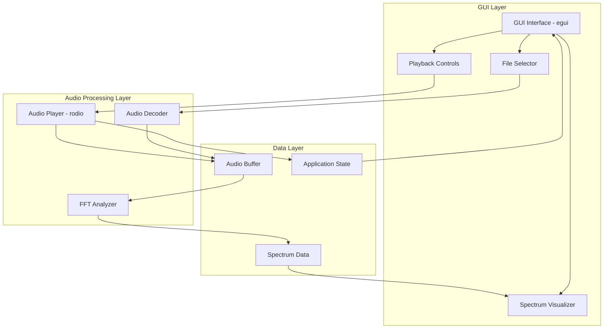
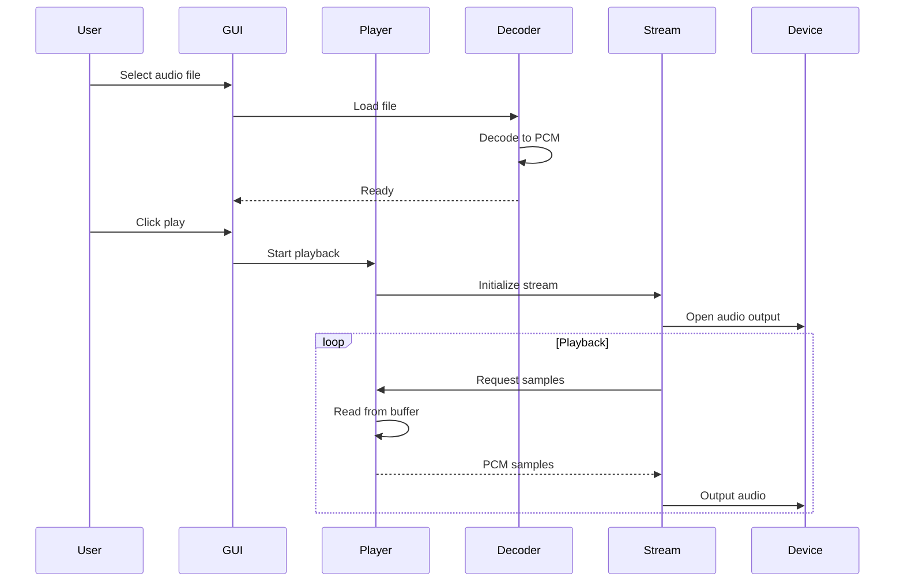
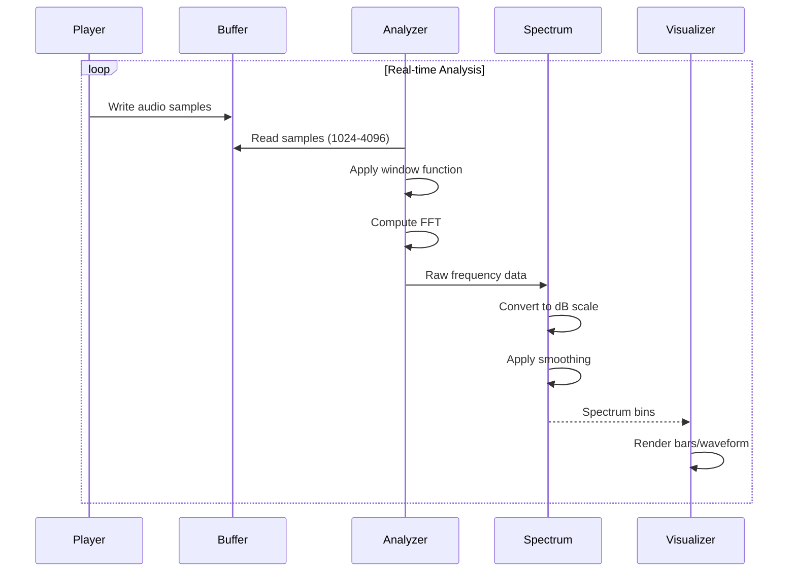
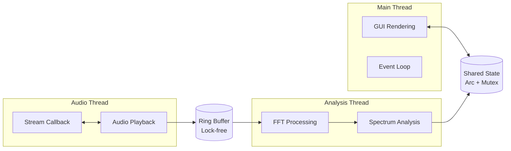

# Audio Visualizer (aviz) - Architecture Design

## 1. System Overview

The Audio Visualizer (aviz) is a real-time audio visualization application built in Rust that provides an interactive GUI for playing audio files and displaying their frequency spectrum. The system processes audio data through FFT analysis and renders a visually appealing spectrum visualization synchronized with playback.

### Key Features
- **Audio Format Support**: MP3 and WAV file playback
- **Real-time FFT Analysis**: Frequency spectrum computation for visualization
- **Interactive GUI**: Play, pause, stop controls and file selection
- **Visual Spectrum Display**: Dynamic frequency visualization with smooth animations
- **Cross-platform**: Runs on Windows, macOS, and Linux

### High-Level Architecture



## 2. Component Architecture

### 2.1 Core Components

#### GUI Module (`gui/`)
**Responsibility**: User interface rendering and interaction handling

**Sub-components**:
- **Main Window**: Application window management using egui
- **Control Panel**: Play/pause/stop buttons, volume slider, progress bar
- **File Browser**: Native file dialog for audio file selection
- **Spectrum Visualizer**: Real-time frequency spectrum rendering

**Key Operations**:
- Render UI elements at 60 FPS
- Handle user input events
- Update visualization based on spectrum data
- Display playback status and metadata

#### Audio Module (`audio/`)
**Responsibility**: Audio file decoding, playback, and streaming

**Sub-components**:
- **Decoder**: Decode MP3 and WAV files into PCM samples
- **Player**: Audio playback engine with controls
- **Stream Manager**: Manage audio output stream
- **Buffer Manager**: Handle audio sample buffering

**Key Operations**:
- Load and decode audio files
- Control playback state (play, pause, stop, seek)
- Stream audio to output device
- Provide audio samples for analysis

#### Analysis Module (`analysis/`)
**Responsibility**: Real-time FFT computation and spectrum analysis

**Sub-components**:
- **FFT Processor**: Perform Fast Fourier Transform on audio samples
- **Spectrum Analyzer**: Convert FFT output to frequency bins
- **Windowing**: Apply window functions (Hann, Hamming) to reduce spectral leakage
- **Smoothing**: Temporal smoothing for stable visualization

**Key Operations**:
- Process audio samples in real-time
- Compute frequency spectrum (0-22kHz range)
- Apply logarithmic scaling for perceptual accuracy
- Smooth spectrum data for visual stability

#### State Module (`state/`)
**Responsibility**: Application state management and synchronization

**Sub-components**:
- **Playback State**: Current playback status, position, duration
- **Audio Metadata**: File information, sample rate, channels
- **Visualization State**: Spectrum data, display settings
- **Settings**: User preferences and configuration

**Key Operations**:
- Maintain thread-safe shared state
- Synchronize between audio and GUI threads
- Handle state transitions
- Persist user settings

## 3. Module Structure

```
src/
├── main.rs                 # Application entry point
├── app.rs                  # Main application struct
├── gui/
│   ├── mod.rs             # GUI module exports
│   ├── window.rs          # Main window setup
│   ├── controls.rs        # Playback control widgets
│   ├── visualizer.rs      # Spectrum visualization
│   └── file_dialog.rs     # File selection dialog
├── audio/
│   ├── mod.rs             # Audio module exports
│   ├── decoder.rs         # Audio file decoding
│   ├── player.rs          # Playback engine
│   ├── stream.rs          # Audio stream management
│   └── buffer.rs          # Sample buffering
├── analysis/
│   ├── mod.rs             # Analysis module exports
│   ├── fft.rs             # FFT processing
│   ├── spectrum.rs        # Spectrum analysis
│   ├── window.rs          # Window functions
│   └── smoothing.rs       # Temporal smoothing
├── state/
│   ├── mod.rs             # State module exports
│   ├── playback.rs        # Playback state
│   ├── metadata.rs        # Audio metadata
│   └── settings.rs        # Application settings
└── utils/
    ├── mod.rs             # Utility module exports
    └── ring_buffer.rs     # Lock-free ring buffer
```

## 4. Data Flow

### 4.1 Audio Playback Flow



### 4.2 Visualization Flow



### 4.3 Thread Architecture



## 5. Recommended Rust Crates

### 5.1 Audio Processing

#### **rodio** (v0.19)
- **Purpose**: Audio playback and decoding
- **Justification**: 
  - Pure Rust audio playback library
  - Built-in support for MP3 (via minimp3) and WAV formats
  - Cross-platform audio output (ALSA, WASAPI, CoreAudio)
  - Simple API for playback controls
  - Active maintenance and good documentation
- **Usage**: Main audio playback engine

#### **symphonia** (v0.5) - Alternative/Supplementary
- **Purpose**: Advanced audio decoding
- **Justification**:
  - More comprehensive format support
  - Better performance for complex formats
  - Modular architecture
  - Can be used alongside rodio for enhanced decoding
- **Usage**: Optional for advanced audio format support

### 5.2 FFT Analysis

#### **rustfft** (v6.2)
- **Purpose**: Fast Fourier Transform computation
- **Justification**:
  - Pure Rust, no C dependencies
  - SIMD-accelerated for high performance
  - Supports arbitrary FFT sizes
  - Well-tested and widely used
  - Excellent performance characteristics
- **Usage**: Core FFT computation

#### **realfft** (v3.3)
- **Purpose**: Real-to-complex FFT optimization
- **Justification**:
  - Optimized for real-valued audio data
  - Wraps rustfft with convenience methods
  - ~2x performance improvement over complex FFT
  - Reduces memory usage
- **Usage**: Primary FFT interface for audio analysis

### 5.3 GUI Framework

#### **egui** (v0.29)
- **Purpose**: Immediate mode GUI framework
- **Justification**:
  - Pure Rust, easy to use
  - Excellent performance for real-time rendering
  - Cross-platform (native + web via WASM)
  - Built-in widgets and customization
  - Active development and community
  - Perfect for data visualization
- **Usage**: Main GUI framework

#### **eframe** (v0.29)
- **Purpose**: egui application framework
- **Justification**:
  - Official framework for egui apps
  - Handles window creation and event loop
  - Integrates with wgpu for GPU rendering
  - Simplifies cross-platform deployment
- **Usage**: Application framework wrapper

#### **egui_plot** (v0.29)
- **Purpose**: Plotting and visualization
- **Justification**:
  - Native egui plotting library
  - Optimized for real-time data
  - Customizable appearance
  - Good performance for spectrum visualization
- **Usage**: Spectrum visualization rendering

### 5.4 Utility Crates

#### **ringbuf** (v0.4)
- **Purpose**: Lock-free ring buffer
- **Justification**:
  - Lock-free SPSC (single producer, single consumer)
  - Perfect for audio thread communication
  - Zero-copy operations
  - Prevents audio glitches from lock contention
- **Usage**: Audio sample buffering between threads

#### **rfd** (v0.15)
- **Purpose**: Native file dialogs
- **Justification**:
  - Cross-platform file picker
  - Native OS dialogs
  - Async support
  - Simple API
- **Usage**: File selection dialog

#### **anyhow** (v1.0)
- **Purpose**: Error handling
- **Justification**:
  - Ergonomic error handling
  - Context propagation
  - Standard in Rust ecosystem
- **Usage**: Application-level error handling

#### **thiserror** (v1.0)
- **Purpose**: Custom error types
- **Justification**:
  - Derive macro for error types
  - Good error messages
  - Integrates with anyhow
- **Usage**: Library-level error definitions

#### **tracing** (v0.1)
- **Purpose**: Logging and diagnostics
- **Justification**:
  - Structured logging
  - Performance tracing
  - Async-aware
  - Rich ecosystem
- **Usage**: Application logging and debugging

#### **serde** (v1.0) + **serde_json** (v1.0)
- **Purpose**: Serialization
- **Justification**:
  - Settings persistence
  - Configuration management
  - Standard serialization framework
- **Usage**: Save/load user settings

## 6. Implementation Phases

### Phase 1: Foundation
**Goal**: Basic application structure and audio playback

**Tasks**:
1. Set up project structure with modules
2. Implement basic egui window with eframe
3. Integrate rodio for audio playback
4. Create simple playback controls (play, pause, stop)
5. Add file selection dialog with rfd
6. Implement basic error handling

**Deliverables**:
- Application launches with GUI
- Can load and play MP3/WAV files
- Basic playback controls work

### Phase 2: FFT Analysis
**Goal**: Real-time frequency analysis

**Tasks**:
1. Implement audio sample capture from playback stream
2. Set up ring buffer for thread-safe sample transfer
3. Create FFT processing pipeline with realfft
4. Implement window functions (Hann window)
5. Convert FFT output to frequency bins
6. Add logarithmic frequency scaling

**Deliverables**:
- Real-time FFT computation working
- Frequency spectrum data available
- Minimal performance impact on playback

### Phase 3: Visualization
**Goal**: Visual spectrum display

**Tasks**:
1. Design spectrum visualizer widget
2. Implement bar-based frequency display
3. Add color gradients based on amplitude
4. Implement temporal smoothing
5. Add visualization settings (bar count, colors, scale)
6. Optimize rendering performance

**Deliverables**:
- Smooth, responsive spectrum visualization
- Visually appealing design
- Configurable appearance

### Phase 4: Polish & Features
**Goal**: Enhanced user experience

**Tasks**:
1. Add seek/scrub functionality
2. Display audio metadata (title, duration, format)
3. Implement volume control
4. Add visualization presets
5. Implement settings persistence
6. Add keyboard shortcuts
7. Improve error messages and handling
8. Performance optimization

**Deliverables**:
- Full-featured audio player
- Professional user interface
- Stable and performant application

### Phase 5: Advanced Features (Optional)
**Goal**: Extended capabilities

**Tasks**:
1. Multiple visualization modes (bars, waveform, spectrogram)
2. Audio effects (equalizer, filters)
3. Playlist support
4. Export visualization as video
5. MIDI input for interactive control
6. Plugin system for custom visualizations

**Deliverables**:
- Enhanced visualization options
- Extended audio capabilities
- Modular architecture for extensions

## 7. Technical Considerations

### 7.1 Performance Requirements

- **GUI Refresh Rate**: 60 FPS (16.67ms per frame)
- **FFT Update Rate**: 30-60 Hz (16-33ms per update)
- **FFT Size**: 2048-4096 samples (good frequency resolution)
- **Audio Buffer Size**: 512-2048 samples (low latency)
- **Memory Usage**: < 100 MB typical

### 7.2 Threading Model

1. **Main Thread**: GUI rendering and event handling
2. **Audio Thread**: Audio playback and streaming (managed by rodio)
3. **Analysis Thread**: FFT computation and spectrum analysis

**Synchronization**:
- Use `Arc<Mutex<T>>` for shared state (playback status, metadata)
- Use lock-free ring buffer for audio samples
- Use `Arc<RwLock<T>>` for spectrum data (many readers, one writer)

### 7.3 Audio Processing Pipeline

```
Audio File → Decoder → PCM Samples → Playback Stream → Audio Output
                           ↓
                    Ring Buffer
                           ↓
                    Window Function
                           ↓
                      FFT (realfft)
                           ↓
                  Magnitude Spectrum
                           ↓
                  Logarithmic Scaling
                           ↓
                  Temporal Smoothing
                           ↓
                    Spectrum Data
                           ↓
                    Visualizer
```

### 7.4 Error Handling Strategy

- **Audio Errors**: Graceful degradation, show error message, allow file reselection
- **FFT Errors**: Log error, skip frame, continue visualization
- **GUI Errors**: Log error, continue rendering
- **File I/O Errors**: User-friendly error messages with recovery options

### 7.5 Configuration

**Settings to Persist**:
- Last opened directory
- Volume level
- Visualization preferences (colors, bar count, smoothing)
- Window size and position

**Configuration File**: `~/.config/aviz/settings.json` (Linux/macOS) or `%APPDATA%\aviz\settings.json` (Windows)

## 8. Testing Strategy

### 8.1 Unit Tests
- FFT computation accuracy
- Window function correctness
- Spectrum scaling algorithms
- Buffer management logic

### 8.2 Integration Tests
- Audio decoding and playback
- FFT pipeline end-to-end
- State synchronization between threads

### 8.3 Performance Tests
- FFT computation time
- GUI frame rate under load
- Memory usage profiling
- Audio latency measurement

### 8.4 Manual Testing
- Cross-platform compatibility
- Various audio file formats
- UI responsiveness
- Visual quality assessment

## 9. Future Enhancements

1. **Additional Audio Formats**: FLAC, OGG, AAC support
2. **Advanced Visualizations**: 3D spectrum, circular visualizer, particle effects
3. **Audio Analysis**: Beat detection, tempo analysis, key detection
4. **Recording**: Capture system audio for visualization
5. **Themes**: Multiple color schemes and UI themes
6. **Plugins**: Extensible architecture for custom visualizations
7. **Web Version**: Compile to WASM for browser-based visualizer
8. **VJ Features**: MIDI control, DMX output for lighting

## 10. Dependencies Summary

### Core Dependencies
- `eframe = "0.29"` - Application framework
- `egui = "0.29"` - GUI framework
- `egui_plot = "0.29"` - Plotting and visualization
- `rodio = "0.19"` - Audio playback
- `realfft = "3.3"` - Real-valued FFT
- `rustfft = "6.2"` - FFT computation

### Utility Dependencies
- `ringbuf = "0.4"` - Lock-free ring buffer
- `rfd = "0.15"` - File dialogs
- `anyhow = "1.0"` - Error handling
- `thiserror = "1.0"` - Error types
- `tracing = "0.1"` - Logging
- `tracing-subscriber = "0.3"` - Logging subscriber
- `serde = { version = "1.0", features = ["derive"] }` - Serialization
- `serde_json = "1.0"` - JSON serialization

### Development Dependencies
- `criterion = "0.5"` - Benchmarking
- `approx = "0.5"` - Floating-point comparison in tests

## 11. Getting Started (Post-Implementation)

### Build and Run
```bash
# Development build
cargo build

# Run application
cargo run

# Release build (optimized)
cargo build --release
cargo run --release
```

### Project Commands
```bash
# Run tests
cargo test

# Run benchmarks
cargo bench

# Check code
cargo clippy

# Format code
cargo fmt
```

## 12. Resources and References

### Documentation
- [egui documentation](https://docs.rs/egui/)
- [rodio documentation](https://docs.rs/rodio/)
- [rustfft documentation](https://docs.rs/rustfft/)
- [realfft documentation](https://docs.rs/realfft/)

### Learning Resources
- FFT fundamentals and windowing
- Audio DSP basics
- Immediate mode GUI patterns
- Rust concurrency patterns

### Similar Projects
- Cava (C-based audio visualizer)
- GLava (OpenGL audio visualizer)
- ProjectM (music visualizer)

---

**Document Version**: 1.0  
**Last Updated**: 2026-01-16  
**Author**: Architecture Design Phase
